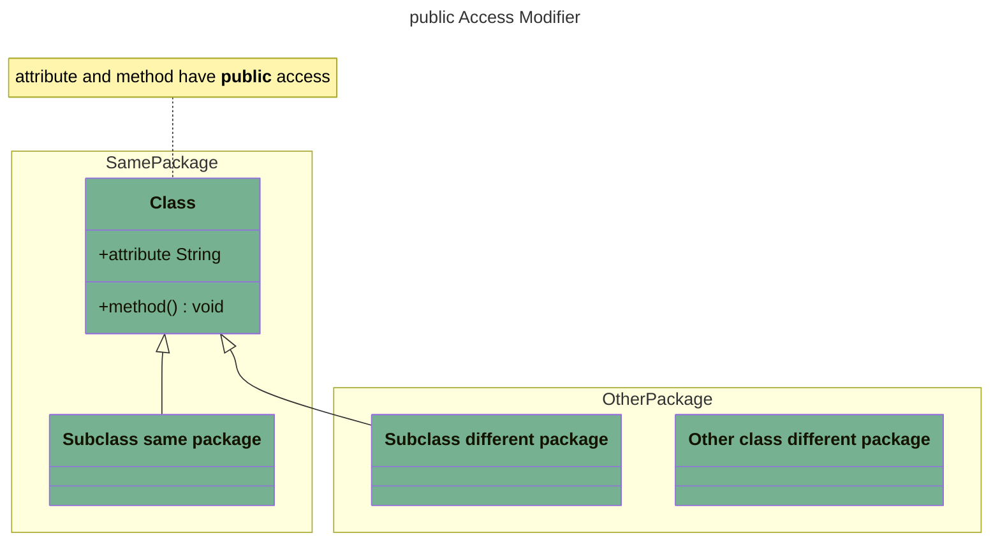
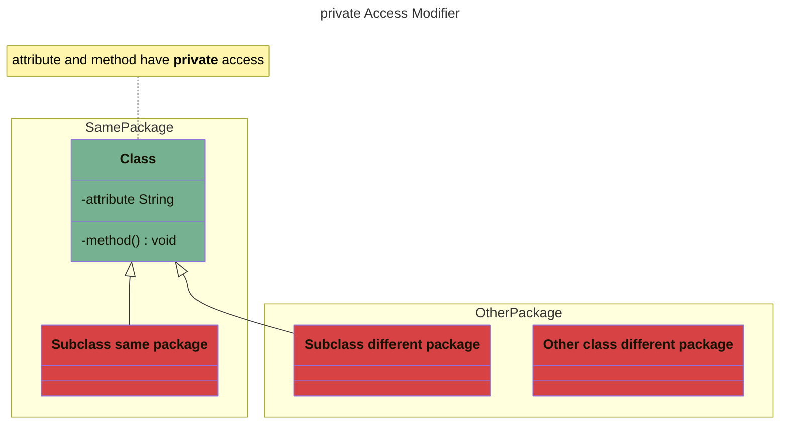
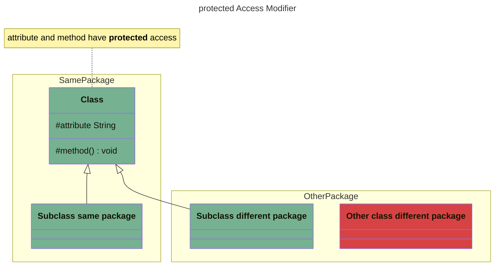
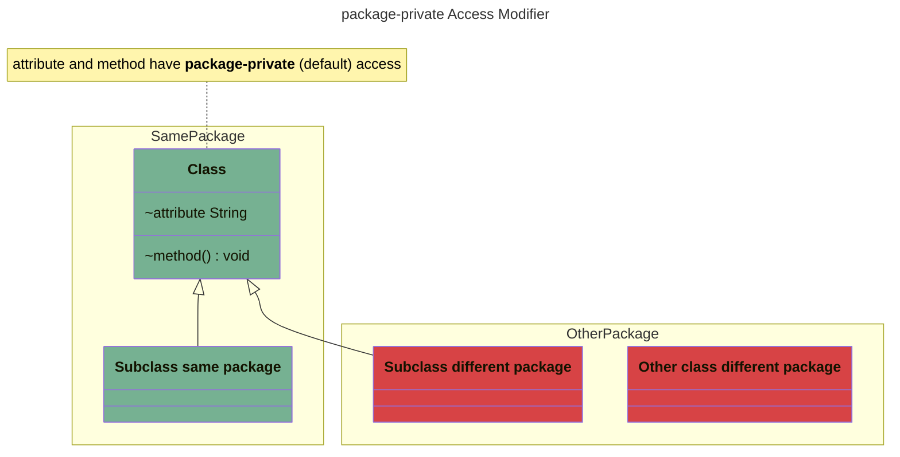
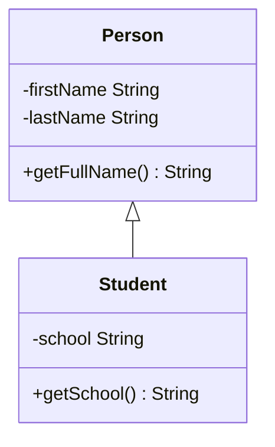

# Java Fundamentals Exercices

## Presentation

This project contains hands-on exercises based on the great Udemy video course
about [Java Fundamentals](https://www.udemy.com/course/java-fundamentals-beginners/) by Jean Claude Bazin's.

## Documentation

### Access Modifiers and Encapsulation

An **access modifier** defines the visibility of the class, field/attribute, or method it is applied to:

- `public`: accessible *everywhere* to *everyone*
- `private`: only accessible in the class in which it is defined.
- `protected`: only accessible in:
    - the same *class*
    - the **subclasses** (classes that inherit from this class) in the same package or not 
    - classes in the **same** package
- *package-private* (default): accessible only in the *package* it is defined in.  
  To use package-private do **not** specify an access modifier.

| Access Modifier | Same Class                        | Class in the same package                       | Class in another package                   | Subclass in the same package                 | Subclass in another package                   |
| --------------- |-----------------------------------|-------------------------------------------------|--------------------------------------------|----------------------------------------------|-----------------------------------------------|
| `public`        | ✅ [example][public_same_class]    | ✅ [example][public_other_class_same_package]    | ✅ [example][public_class_other_package]    | ✅ [example][public_subclass_same_package]    | ✅ [example][public_subclass_other_package]    |
| `private`       | ✅ [example][private_same_class]   | ❌ [example][private_other_class_same_package]   | ❌ [example][private_class_other_package]   | ❌ [example][private_subclass_same_package]   | ❌ [example][private_subclass_other_package]   |
| `protected`     | ✅ [example][protected_same_class] | ✅ [example][protected_other_class_same_package] | ❌ [example][protected_class_other_package] | ✅ [example][protected_subclass_same_package] | ✅ [example][protected_subclass_other_package] |
| package-private | ✅ [example][package_same_class]   | ✅ [example][package_other_class_same_package]   | ❌ [example][package_class_other_package]   | ✅ [example][package_subclass_same_package]   | ❌ [example][package_subclass_other_package]   |

Let's break down these access modifiers with visual class diagrams.
The diagram use colors define who can access:

- 🟩 <span style="color: #76B192;">green</span>: can access
- 🟥 <span style="color: #D74345;">red</span>: **CANNOT** access



---



---



---



Source: [#55: Access levels](https://www.udemy.com/course/java-fundamentals-beginners/learn/lecture/46066801#overview)

ℹ️ I used [Mermaid](https://mermaid.js.org/) to build the above [class diagrams](https://mermaid.js.org/syntax/classDiagram.html).

> **Mermaid** is an "extension" of Markdown.
> It is supported by a growing number of [products and platforms](https://mermaid.js.org/ecosystem/integrations-community.html#community-integrations) among which GitHub.
> We can describe diagrams and charts using a Mermaid text syntax.
> It offers a wide range of **diagram types**:
> 
> - [Flow chart](https://mermaid.js.org/syntax/flowchart.html),
> - [Class diagrams](https://mermaid.js.org/syntax/classDiagram.html),
> - [Sequence diagram](https://mermaid.js.org/syntax/sequenceDiagram.html),
> - [State diagram](https://mermaid.js.org/syntax/stateDiagram.html),
> - [Git diagram](https://mermaid.js.org/syntax/gitgraph.html),
> - ...
>

Source:    

````

````

Output:  


[public_same_class]:    https://github.com/ebouchut-laplateforme/java-fundamentals/blob/main/src/main/java/com/ericbouchut/oop/accessmodifiers/publicmod/AccessPublicFromClass.java
[private_same_class]:   https://github.com/ebouchut-laplateforme/java-fundamentals/blob/main/src/main/java/com/ericbouchut/oop/accessmodifiers/privatemod/AccessPrivateFromClass.java
[protected_same_class]: https://github.com/ebouchut-laplateforme/java-fundamentals/blob/main/src/main/java/com/ericbouchut/oop/accessmodifiers/protectedmod/AccessProtectedFromClass.java
[package_same_class]:   https://github.com/ebouchut-laplateforme/java-fundamentals/blob/main/src/main/java/com/ericbouchut/oop/accessmodifiers/packagemod/AccessPackageFromClass.java

[public_other_class_same_package]:    https://github.com/ebouchut-laplateforme/java-fundamentals/blob/main/src/main/java/com/ericbouchut/oop/accessmodifiers/publicmod/AccessPublicFromClassSamePackage.java
[private_other_class_same_package]:   https://github.com/ebouchut-laplateforme/java-fundamentals/blob/main/src/main/java/com/ericbouchut/oop/accessmodifiers/privatemod/AccessPrivateFromClassSamePackage.java
[protected_other_class_same_package]: https://github.com/ebouchut-laplateforme/java-fundamentals/blob/main/src/main/java/com/ericbouchut/oop/accessmodifiers/protectedmod/AccessProtectedFromClassSamePackage.java
[package_other_class_same_package]:   https://github.com/ebouchut-laplateforme/java-fundamentals/blob/main/src/main/java/com/ericbouchut/oop/accessmodifiers/packagemod/AccessPackageFromClassSamePackage.java

[public_class_other_package]:    https://github.com/ebouchut-laplateforme/java-fundamentals/blob/main/src/main/java/com/ericbouchut/oop/accessmodifiers/AccessPublicFromClassOtherPackage.java
[private_class_other_package]:   https://github.com/ebouchut-laplateforme/java-fundamentals/blob/main/src/main/java/com/ericbouchut/oop/accessmodifiers/AccessPrivateFromClassOtherPackage.java
[protected_class_other_package]: https://github.com/ebouchut-laplateforme/java-fundamentals/blob/main/src/main/java/com/ericbouchut/oop/accessmodifiers/AccessProtectedFromClassOtherPackage.java
[package_class_other_package]:   https://github.com/ebouchut-laplateforme/java-fundamentals/blob/main/src/main/java/com/ericbouchut/oop/accessmodifiers/AccessPackageFromClassOtherPackage.java

[public_subclass_same_package]:    https://github.com/ebouchut-laplateforme/java-fundamentals/blob/main/src/main/java/com/ericbouchut/oop/accessmodifiers/publicmod/AccessPublicFromSubclass.java
[private_subclass_same_package]:   https://github.com/ebouchut-laplateforme/java-fundamentals/blob/main/src/main/java/com/ericbouchut/oop/accessmodifiers/privatemod/AccessPrivateFromSubclass.java
[protected_subclass_same_package]: https://github.com/ebouchut-laplateforme/java-fundamentals/blob/main/src/main/java/com/ericbouchut/oop/accessmodifiers/protectedmod/AccessProtectedFromSubclass.java
[package_subclass_same_package]:   https://github.com/ebouchut-laplateforme/java-fundamentals/blob/main/src/main/java/com/ericbouchut/oop/accessmodifiers/packagemod/AccessPackageFromSubclass.java

[public_subclass_other_package]:    https://github.com/ebouchut-laplateforme/java-fundamentals/blob/main/src/main/java/com/ericbouchut/oop/accessmodifiers/AccessPublicFromFromSubclassOtherPackage.java
[private_subclass_other_package]:   https://github.com/ebouchut-laplateforme/java-fundamentals/blob/main/src/main/java/com/ericbouchut/oop/accessmodifiers/AccessPrivateFromSubclassOtherPackage.java
[protected_subclass_other_package]: https://github.com/ebouchut-laplateforme/java-fundamentals/blob/main/src/main/java/com/ericbouchut/oop/accessmodifiers/AccessProtectedFromSubclassOtherPackage.java
[package_subclass_other_package]:   https://github.com/ebouchut-laplateforme/java-fundamentals/blob/main/src/main/java/com/ericbouchut/oop/accessmodifiers/AccessPackageFromSubclassOtherPackage.java