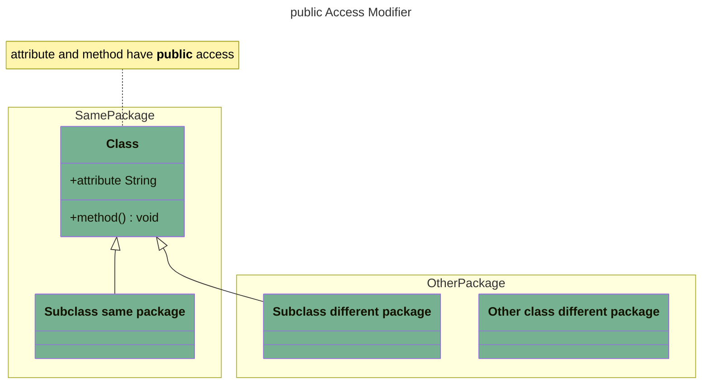
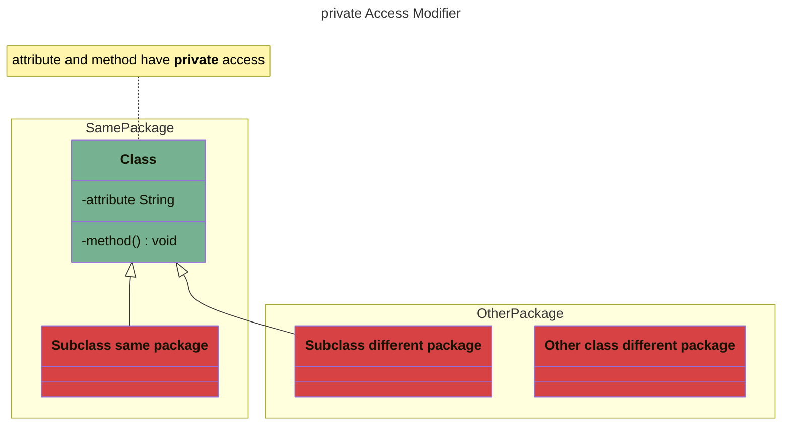
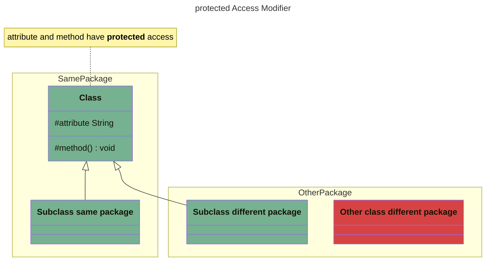
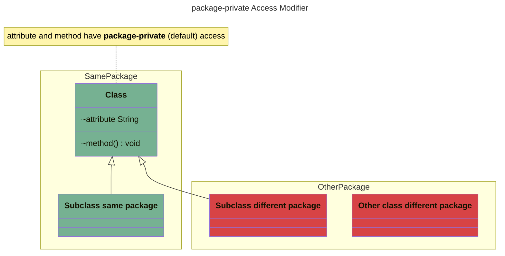

# Java Fundamentals Exercices

## Presentation

This project contains hands-on exercises based on the great Udemy video course
about [Java Fundamentals](https://www.udemy.com/course/java-fundamentals-beginners/) by Jean Claude Bazin's.

## Documentation

### Access Modifiers and Encapsulation

An **access modifier** defines the visibility of the class, field/attribute, or method it is applied to:

- `private`: accessible only in the class in which it is defined.
- `default`: also known as *package-private*, accessible only in the *package* it is defined in. To use package-private we do not specify the access modifier.
- `protected`: accessible only in:
    - the same *package*
    - the same *class*
    - the *subclasses*
- `public`: accessible *everywhere* to *everyone*

| Access Modifier | Same Class | Class in the same package | Class in another package | Subclass in the same package | Subclass in another package |
| --------------- | ---------- | ------------------------- | ------------------------ | ---------------------------- | --------------------------- |
| `public`        | ✅          | ✅                         | ✅                        | ✅                            | ✅                           |
| `private`       | ✅          | ❌                         | ❌                        | ❌                            | ❌                           |
| `protected`     | ✅          | ✅                         | ❌                        | ✅                            | ✅                           |
| package-private | ✅          | ✅                         | ❌                        | ✅                            | ❌                           |

Let's break down these access modifiers with visual class diagrams.

