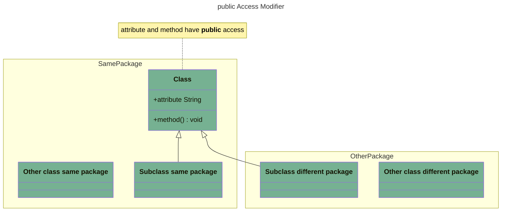
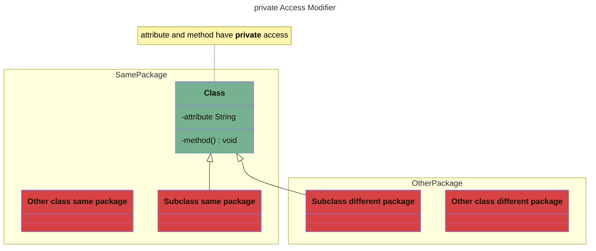
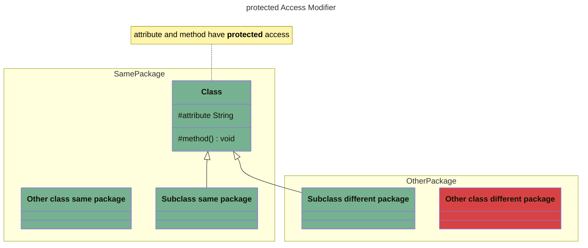
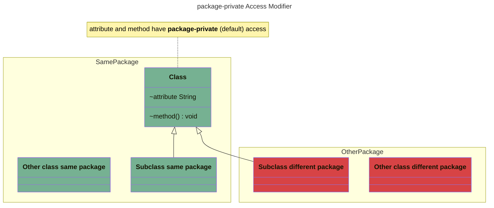
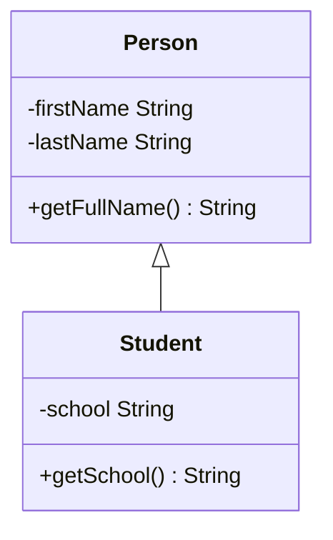
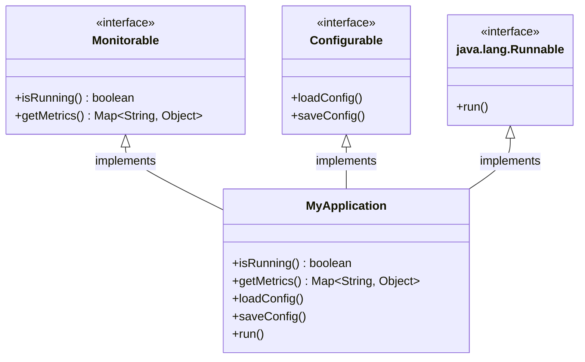

# Java Fundamentals Exercises

## Presentation

This project contains hands-on exercises based on the great Udemy video course
about [Java Fundamentals](https://www.udemy.com/course/java-fundamentals-beginners/) by Jean-Claude Bazin.


## Documentation

### Access Modifiers and Encapsulation

An **access modifier** defines the visibility of the class, field/attribute, or method it is applied to:

- `public`: accessible *everywhere* to *everyone*
- `private`: only accessible in the class in which it is defined.
- `protected`: only accessible in:
    - the same *class*
    - the **subclasses** (classes that inherit from this class) in the same package or not 
    - classes in the **same** package
- *package-private* (default): accessible only in the *package* it is defined in.  
  To use package-private do **not** specify an access modifier.

| Access Modifier | Same Class                        | Class in the same package                       | Class in another package                   | Subclass in the same package                 | Subclass in another package                   |
| --------------- |-----------------------------------|-------------------------------------------------|--------------------------------------------|----------------------------------------------|-----------------------------------------------|
| `public`        | ✅ [example][public_same_class]    | ✅ [example][public_other_class_same_package]    | ✅ [example][public_class_other_package]    | ✅ [example][public_subclass_same_package]    | ✅ [example][public_subclass_other_package]    |
| `private`       | ✅ [example][private_same_class]   | ❌ [example][private_other_class_same_package]   | ❌ [example][private_class_other_package]   | ❌ [example][private_subclass_same_package]   | ❌ [example][private_subclass_other_package]   |
| `protected`     | ✅ [example][protected_same_class] | ✅ [example][protected_other_class_same_package] | ❌ [example][protected_class_other_package] | ✅ [example][protected_subclass_same_package] | ✅ [example][protected_subclass_other_package] |
| package-private | ✅ [example][package_same_class]   | ✅ [example][package_other_class_same_package]   | ❌ [example][package_class_other_package]   | ✅ [example][package_subclass_same_package]   | ❌ [example][package_subclass_other_package]   |

Let's break down these access modifiers with visual class diagrams.
The diagram use colors that define who can access:

- 🟩 <span style="color: #76B192;">green</span>: can access
- 🟥 <span style="color: #D74345;">red</span>: **CANNOT** access



---



---



---



Source: [#55: Access levels](https://www.udemy.com/course/java-fundamentals-beginners/learn/lecture/46066801#overview)

ℹ️ I used [Mermaid](https://mermaid.js.org/) to build the above [class diagrams](https://mermaid.js.org/syntax/classDiagram.html).

> **Mermaid** is an "extension" of Markdown.
> It is supported by a growing number of [products and platforms](https://mermaid.js.org/ecosystem/integrations-community.html#community-integrations) among which GitHub.
> We can describe diagrams and charts using a Mermaid text syntax.
> It offers a wide range of **diagram types**:
> 
> - [Flow chart](https://mermaid.js.org/syntax/flowchart.html),
> - [Class diagrams](https://mermaid.js.org/syntax/classDiagram.html),
> - [Sequence diagram](https://mermaid.js.org/syntax/sequenceDiagram.html),
> - [State diagram](https://mermaid.js.org/syntax/stateDiagram.html),
> - [Git diagram](https://mermaid.js.org/syntax/gitgraph.html),
> - ...
>

Here is an example of a class diagram showing the Mermaid source code first, and then the rendering.

Source:    

````

````

Output:  


### Interfaces

#### Class Implementing Multiple Interfaces

```java
package com.ericbouchut.oop.inheritance;  
  
import java.util.Map;  
  
/**  
 * This class implements several interfaces. 
 */
 class MyApplicationMultipleInterfaces implements Monitorable, Configurable, Runnable {  
    private boolean isRunning;  
  
    public static void main(String[] args) {  
        MyApplicationMultipleInterfaces app = new MyApplicationMultipleInterfaces();  
  
        System.out.println("isRuning(): " + app.isRunning());  
        app.run();  
        app.stop();  
    }  
  
    @Override  
    public boolean isRunning() {  
        return isRunning;  
    }  
  
    @Override  
    public Map<String, Object> getMetrics() {  
        return Map.of(  
                "error", 42,  
                "success", 567  
        );  
    }  
  
    @Override  
    public void loadConfig() {  
        System.out.println("Loading configuration.");  
    }  
  
    @Override  
    public void saveConfig() {  
        System.out.println("Saving configuration.");  
    }  
  
    @Override  
    public void run() {  
        System.out.println("Running...");  
        try {  
            start();  
            monitor();  
        } catch (Exception ex) {  
            // Handle exception  
        } finally {  
            stop();  
        }  
    }  
  
    protected void monitor() {  
        System.out.println("Monitoring...");  
        System.out.println("App isRunning?: " + isRunning());  
  
        System.out.println("App Metrics:" );  
        for (Map.Entry<String, ?> metricEntry: getMetrics().entrySet()) {  
            System.out.print("\t- ");  
            System.out.println(metricEntry);  
        }  
    }  
  
    protected void start() {  
        System.out.println("Starting the App...");  
  
        if (!isRunning()) {  
            loadConfig();  
            isRunning = true;  
        }  
    }  
  
    protected void stop() {  
        System.out.println("Stopping the App...");  
  
        if (isRunning()) {  
            saveConfig();  
            isRunning = false;  
        }  
    }  
}
```

[Source](https://github.com/ebouchut-laplateforme/java-fundamentals/blob/b460b3f024b7acaba7e846feea4130f27ea563d3/src/main/java/com/ericbouchut/oop/inheritance/MyApplicationMultipleInterfaces.java)

The [MyApplication](https://github.com/ebouchut-laplateforme/java-fundamentals/blob/b460b3f024b7acaba7e846feea4130f27ea563d3/src/main/java/com/ericbouchut/oop/inheritance/MyApplicationMultipleInterfaces.java) class implements several interfaces:

- [Monitorable](https://github.com/ebouchut-laplateforme/java-fundamentals/blob/b460b3f024b7acaba7e846feea4130f27ea563d3/src/main/java/com/ericbouchut/oop/inheritance/Monitorable.java)
- [Configurable](https://github.com/ebouchut-laplateforme/java-fundamentals/blob/b460b3f024b7acaba7e846feea4130f27ea563d3/src/main/java/com/ericbouchut/oop/inheritance/Configurable.java)
- [java.lang.Runnable](https://docs.oracle.com/en/java/javase/25/docs/api/java.base/java/lang/Runnable.html) which basically  defines a `run()` method
    ```java
    @FunctionalInterface  
    public interface Runnable {  
         void run();  
    }
    ```



### Input Output

#### Motion Sickness Lab

The **Motion Sickness** lab is intended as a practice on how to **read and write text files**.

#### Exercise Statement

See [Udemy course](https://www.udemy.com/course/java-fundamentals-beginners/learn/lecture/46090645#overview) for details.

Read a text file ([`symptoms.txt`](https://github.com/ebouchut-laplateforme/java-fundamentals/blob/main/src/main/resources/symptoms.txt))  that contains an **unordered list of symptoms**.  
There is one symptom per line.    
A symptom can contain **spaces**.  
The file can contain **duplicate** symptoms.

- **Read** the input file
- **Process** the input file (but <b>do not modify</b> it), so that you:
  - Order alphabetically the symptoms (i.e., the lines),
  - Remove duplicate symptoms.
  - Count the occurrences of each distinct symptom,
- **Create** a new text file (`results.txt`)
    - With an ordered list of unique symptoms (one per line),
    - With duplicates removed,
    - Using this format: `symptom = occurrences`.
      For instance if you found 11 occurrences of `high blood pressure` in the input file (`symptoms.txt`), you will write once:
      ```txt
      high blood pressure = 11
      ```

Here is what the output file (`results.txt`) should look like:

```txt
anxiety = 7
arrhythmias = 4
blindness = 2
blurred vision = 6
constricted pupils = 3
cough = 7
dialated pupils = 4
dizziness = 6
dry mouth = 10
fever = 9
headache = 4
high blood pressure = 11
inflamation = 9
insomnia = 4
low blood pressure = 4
nausea = 7
rapid heart rate = 1
rash = 6
shortness of breath = 4
stiff neck = 6
stomach pain = 5
tremor = 4
water retention = 1
```

#### Code

You can find the [code here](https://github.com/ebouchut-laplateforme/java-fundamentals/tree/main/src/main/java/com/ericbouchut/io/motionsickness).
I provided 2 versions, one using the regular file reader and writer API, 
the other using the Stream API to learn and practice the functional concepts that have been introduced from Java 1.8 onwards. 

- Java **File** API: [FileSymptomCounter](https://github.com/ebouchut-laplateforme/java-fundamentals/blob/main/src/main/java/com/ericbouchut/io/motionsickness/FileSymptomCounter.java)
- Java **Stream** API: [StreamSymptomCounter](https://github.com/ebouchut-laplateforme/java-fundamentals/blob/main/src/main/java/com/ericbouchut/io/motionsickness/StreamSymptomCounter.java)


[public_same_class]:    https://github.com/ebouchut-laplateforme/java-fundamentals/blob/main/src/main/java/com/ericbouchut/oop/accessmodifiers/publicmod/AccessPublicFromClass.java
[private_same_class]:   https://github.com/ebouchut-laplateforme/java-fundamentals/blob/main/src/main/java/com/ericbouchut/oop/accessmodifiers/privatemod/AccessPrivateFromClass.java
[protected_same_class]: https://github.com/ebouchut-laplateforme/java-fundamentals/blob/main/src/main/java/com/ericbouchut/oop/accessmodifiers/protectedmod/AccessProtectedFromClass.java
[package_same_class]:   https://github.com/ebouchut-laplateforme/java-fundamentals/blob/main/src/main/java/com/ericbouchut/oop/accessmodifiers/packagemod/AccessPackageFromClass.java

[public_other_class_same_package]:    https://github.com/ebouchut-laplateforme/java-fundamentals/blob/main/src/main/java/com/ericbouchut/oop/accessmodifiers/publicmod/AccessPublicFromClassSamePackage.java
[private_other_class_same_package]:   https://github.com/ebouchut-laplateforme/java-fundamentals/blob/main/src/main/java/com/ericbouchut/oop/accessmodifiers/privatemod/AccessPrivateFromClassSamePackage.java
[protected_other_class_same_package]: https://github.com/ebouchut-laplateforme/java-fundamentals/blob/main/src/main/java/com/ericbouchut/oop/accessmodifiers/protectedmod/AccessProtectedFromClassSamePackage.java
[package_other_class_same_package]:   https://github.com/ebouchut-laplateforme/java-fundamentals/blob/main/src/main/java/com/ericbouchut/oop/accessmodifiers/packagemod/AccessPackageFromClassSamePackage.java

[public_class_other_package]:    https://github.com/ebouchut-laplateforme/java-fundamentals/blob/main/src/main/java/com/ericbouchut/oop/accessmodifiers/AccessPublicFromClassOtherPackage.java
[private_class_other_package]:   https://github.com/ebouchut-laplateforme/java-fundamentals/blob/main/src/main/java/com/ericbouchut/oop/accessmodifiers/AccessPrivateFromClassOtherPackage.java
[protected_class_other_package]: https://github.com/ebouchut-laplateforme/java-fundamentals/blob/main/src/main/java/com/ericbouchut/oop/accessmodifiers/AccessProtectedFromClassOtherPackage.java
[package_class_other_package]:   https://github.com/ebouchut-laplateforme/java-fundamentals/blob/main/src/main/java/com/ericbouchut/oop/accessmodifiers/AccessPackageFromClassOtherPackage.java

[public_subclass_same_package]:    https://github.com/ebouchut-laplateforme/java-fundamentals/blob/main/src/main/java/com/ericbouchut/oop/accessmodifiers/publicmod/AccessPublicFromSubclass.java
[private_subclass_same_package]:   https://github.com/ebouchut-laplateforme/java-fundamentals/blob/main/src/main/java/com/ericbouchut/oop/accessmodifiers/privatemod/AccessPrivateFromSubclass.java
[protected_subclass_same_package]: https://github.com/ebouchut-laplateforme/java-fundamentals/blob/main/src/main/java/com/ericbouchut/oop/accessmodifiers/protectedmod/AccessProtectedFromSubclass.java
[package_subclass_same_package]:   https://github.com/ebouchut-laplateforme/java-fundamentals/blob/main/src/main/java/com/ericbouchut/oop/accessmodifiers/packagemod/AccessPackageFromSubclass.java

[public_subclass_other_package]:    https://github.com/ebouchut-laplateforme/java-fundamentals/blob/main/src/main/java/com/ericbouchut/oop/accessmodifiers/AccessPublicFromFromSubclassOtherPackage.java
[private_subclass_other_package]:   https://github.com/ebouchut-laplateforme/java-fundamentals/blob/main/src/main/java/com/ericbouchut/oop/accessmodifiers/AccessPrivateFromSubclassOtherPackage.java
[protected_subclass_other_package]: https://github.com/ebouchut-laplateforme/java-fundamentals/blob/main/src/main/java/com/ericbouchut/oop/accessmodifiers/AccessProtectedFromSubclassOtherPackage.java
[package_subclass_other_package]:   https://github.com/ebouchut-laplateforme/java-fundamentals/blob/main/src/main/java/com/ericbouchut/oop/accessmodifiers/AccessPackageFromSubclassOtherPackage.java
